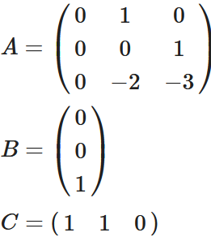

# Root Locus (Kök Yer Eğrisi)
Önceki derslerimizde geri-beslemeli bir kontrol sisteminin genel blok diyagramına göz atmıştık. Burada hatırlamak gerekirse, kontrol edilmek istenen dinamik sistem doğrusal ise o zaman *Şekil 1*'deki gibi bir blok diyagrama sahip oluruz. 

*Şekil 1:* Doğrusal bir sistem üzerinde geri-beslemeli kontrol.

Burada durum uzayı modelimizin matrisleri 

olarak verilirse o zaman sistemin transfer fonksiyonu 

C(sI-a)-1B

formülü kullanılarak 

olarak hesaplanabilir. Burada 3x3'lük matrisin tersini alma işlemi ve diğer matris çarpma işlemlerini derste **MATLAB**'da hem hazır hem de kendi yazdığımız komutlarla gerçekledik ve sonuç olarak tekabül eden transfer fonksiyonunu elde ettik.

Burada **Kök Yer Eğrisi** konusunda kontrol etmek istediğimiz dinamik sistemin değil de geri-beslemeli kontrol sisteminin tamamının transfer fonksiyonu ile ilgileniyoruz. Başka bir deyişle, çıkış sinyalimiz Y(s)'nin referans sinyalimiz R(s)'ye oranını bulup K kazancındaki değişimin transfer fonksiyonuna etkilerini (yani sistemin cevabındaki değişimi) gözlemlemek istiyoruz. Sistemin çıkışının girişe oranı olan Y(s)/U(s) ifadesini bulduk. Kontrol sinyali U(s) ile hata sinyali E(s) arasında  

U(s) = KE(s) 

şeklinde bir ilişkinin olduğunu *Şekil 1*'den faydalanarak görebiliriz. Böylece 

buluruz. Yine blok diyagramdan 

E(s)=R(s)-Y(s) 

olduğunu da görebiliriz. Sonuç olarak R(s) ile Y(s) arasında matematiksel bir ifade bulmak istediğimizden ilk önce 

ifadesinde E(s) yerine R(s) - Y(s) ifadesini koyalım ve 

elde edelim. Başka bir ifadeyle 

U(s) = K(R(s) - Y(s))

olur. Bu ifadeyi de Y(s)/U(s) ifadesinde yerine koyarsak 

olur. İçler dışlar çarpımıyla devam edersek 

Y(s)s(s+1)(s+2) = KR(s) - KY(s) 

elde ederiz. Buradan da *Şekil 1*'de görülen geri beslemeli kontrol sisteminin tamamının transfer fonksiyonu olan R(s)/Y(s) ifadesini 

olarak buluruz. Görüldüğü gibi bu transfer fonksiyonunun kutupları (i.e., paydanın kökleri) K değiştikçe farklı değerler almaktadır. Kazanç K değiştikçe kutupların aldığı konumların çizimini (i.e., kök yer eğrisi - root locus) *Şekil 2*'da görebilirsiniz. Her bir kutubun aldığı değerler farklı renkle çizdirilmiştir. Unutmayın; belirli bir K değeri için mavi, yeşil ve kırmızı grafikler üzerinde belirli bir kutup değeri vardır. Kazanç değiştikçe kökler beraber hareket ederler.

*Şekil 2:* Kök yer eğrisi (root locus).

## Kök Yer Eğrisi Animasyonu
Aşağıda *Şekil 3*'de verilen Simulink modelini K=0'dan K=8'e kadar artan kazanç değerleri için koşturduğumuzda, geri-beslemeli sistemin birim basamak cevabını *Şekil 4*'de görüldüğü gibi elde ediyoruz.

*Şekil 3:* Kök yer eğrisi için incelediğimiz sistemin Simulink modeli.

*Şekil 4:* Geri-beslemeli kontrol sisteminin basamak girişine verdiği cevabın değişen kutup değerleriyle görülmesi1.

Yukarıda görüldüğü gibi yaklaşık olarak K>6 için sistem cevabında gözlemlenen osilasyonlar artık sönümlenemiyor ve sistem kararsız hale geliyor. Bunun sebebi kök yer eğrisi grafiğinde üç kutuptan ikisinin reel kısımlarının artık s-alanının sağ tarafında geçmesi (yani başka bir deyişle pozitif değerler alması). Sadece bir kutubun bile reel kısmı sanal eksenin sağına geçse sistem dinamiklerinde kararsızlık ortaya çıkar. Kutuplarının reel kısımlarının işaretinin (i.e., pozitif veya negatif olması) neden sistem kararlılığını etkilediğini Laplace (s) alanında çarpım işlemleri ve zaman alanında konvolüsyon (evrişim integrali) kullanarak anlamaya çalışalım.

## Dipnotlar
1 Bu animasyonu üreten kodu yukarıda **kod** bölümünde **root_locus.m** ismiyle bulabilirsiniz. Kodun **root_locus_sim.mdl** isimli Simulink dosyasına bağımlılığı olduğundan her iki dosyayı da aynı konuma kaydedip m dosyasını koşturmanız gerekir.

## Kaynaklar

